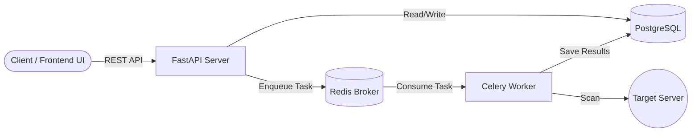

<div align="center">
  
  <h1>VulnLens</h1>
  <p><b>A modern, scalable, and defensive website security scanner API & Dashboard</b></p>
  
  [](https://www.python.org/downloads/)
  [](https://fastapi.tiangolo.com)
  [](https://docs.celeryq.dev/)
  [](https://react.dev/)
  [](https://opensource.org/licenses/MIT)
</div>

<br/>

**VulnLens** is a website security scanner. It performs comprehensive posture checks by analyzing HTTP security headers, TLS certificates, common TCP ports, and technology stacks. Built with scalability in mind, it utilizes an asynchronous architecture to handle concurrent scans efficiently and generates professional PDF reports for its findings.

> **Defensive Use Only:** VulnLens is strictly for posture checks and configuration analysis. It does **not** exploit vulnerabilities, run offensive payloads, or automate attacks. Always ensure you have authorization to scan a target.

---

## Key Features

* **Comprehensive Scanning Modules:**
  * **SSL/TLS:** Certificate expiry, chain trust, hostname match, key strength, negotiated TLS version, and cipher checks.
  * **HTTP Headers:** HSTS, CSP, X-Frame-Options, cookie flags, and server disclosure analysis.
  * **Port Scanning:** Fast, asynchronous TCP probes on curated port lists to identify exposed risky services (e.g., Telnet, RDP, Redis).
  * **Technology Fingerprinting:** Passive detection of underlying technologies, CMS platforms, and frameworks via headers and body signatures.
* **Production-Grade Architecture:** Background job processing via **Celery** and **Redis** ensures the API remains lightning-fast, while **PostgreSQL** provides persistent job and result history.
* **Professional Reporting:** Export detailed findings, severity summaries, and module-specific data as highly polished PDF reports using WeasyPrint and Jinja2.
* **Modern Frontend:** A beautiful, responsive UI built with **React 19**, **Vite**, and **Tailwind CSS v4** for managing scans and visualizing reports.
* **Security Built-in:** SSRF mitigation prevents scanning of private/loopback targets. Optional API key authentication protects your endpoints. Safe socket interactions without `subprocess` or shell execution.

---

## Screenshots

*(Add screenshots of your dashboard, scan results, and PDF reports here before publishing to GitHub)*
* 
* 
* 
* 

---

## Architecture

VulnLens completely decouples the web routing from the heavy network scanning logic to guarantee maximum throughput and non-blocking I/O.



### Tech Stack
* **Backend:** FastAPI, Pydantic, SQLAlchemy, Alembic
* **Workers:** Celery, Redis
* **Database:** PostgreSQL
* **Scanning Engines:** `httpx`, `cryptography`, standard library `ssl`/`socket`
* **Report Generation:** Jinja2, WeasyPrint
* **Frontend:** React 19, Vite, Tailwind CSS, TanStack React Query

---

## Quick Start (Docker)

The fastest way to get VulnLens up and running is using Docker Compose.

### Prerequisites
* Docker & Docker Compose

### Running the Environment

1. Clone the repository:
   ```bash
   git clone https://github.com/OmarAlali5/vulnlens.git
   cd vulnlens
   ```

2. Start the backend services:
   ```bash
   docker compose up --build -d
   ```

3. Apply database migrations (required on the first run):
   ```bash
   docker compose exec api alembic upgrade head
   ```

**Available Services:**
* **API Server:** `http://localhost:8000`
* **Interactive API Docs (Swagger UI):** `http://localhost:8000/docs`

---

## Environment Configuration

Set up your `.env` file to customize the deployment. See `.env.example` for defaults.

| Variable | Description | Default |
|----------|-------------|---------|
| `DATABASE_URL` | PostgreSQL connection string | `postgresql://...` |
| `CELERY_BROKER_URL` | Redis connection string | `redis://...` |
| `API_KEY` | Secret key to protect API endpoints (optional) | `None` |
| `BLOCK_PRIVATE_TARGETS` | Enable SSRF protection against internal IPs | `True` |
| `CORS_ORIGINS` | Allowed CORS origins (JSON array string) | `["http://localhost:5173", ...]` |

---

## 📖 API Reference

### 1. Create a New Scan
`POST /api/v1/scans/`

```json
{
  "target": "https://example.com",
  "options": {
    "ssl_scan": true,
    "headers_scan": true,
    "port_scan": true,
    "tech_scan": true,
    "port_list": null
  }
}
```
*Returns `202 Accepted` with a `scan_id`.*

### 2. Check Scan Status
`GET /api/v1/scans/{scan_id}`
*Poll this endpoint to retrieve real-time status (`PENDING`, `RUNNING`, `COMPLETED`, `FAILED`) and the final structured findings.*

### 3. Download PDF Report
`GET /api/v1/reports/{scan_id}/pdf`
*Returns the finalized PDF report for a `COMPLETED` scan.*

---

## Security Philosophy & Disclaimer

VulnLens is built with a defensive engineering mindset:
* **Authorization First:** Only scan systems you own or have explicit authorization to assess.
* **SSRF Protection:** By default, VulnLens rejects targets resolving to internal or private IP ranges to prevent abuse of the scanning infrastructure.
* **Non-destructive:** Scans employ standard network requests and client libraries without executing shell commands or dropping payloads.
* **No Subprocess:** Python's native `socket`, `ssl`, and `httpx` modules are used exclusively, eliminating OS-level command injection risks.

---

## Roadmap

- [ ] Add Subdomain Enumeration module.
- [ ] Implement DNS Rebinding protections for the worker nodes.
- [ ] Package Frontend inside a multi-stage Docker container for all-in-one deployment.
- [ ] Add Webhook support to notify clients when a scan completes.
- [ ] Support custom HTTP User-Agent definitions per scan.

---

## 🤝 Contributing

Contributions are what make the open source community such an amazing place to learn, inspire, and create. Any contributions you make are **greatly appreciated**.

1. Fork the Project
2. Create your Feature Branch (`git checkout -b feature/AmazingFeature`)
3. Commit your Changes (`git commit -m 'Add some AmazingFeature'`)
4. Push to the Branch (`git push origin feature/AmazingFeature`)
5. Open a Pull Request

---

## 📄 License

This project is licensed under the MIT License - see the [LICENSE](LICENSE) file for details.
